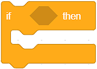
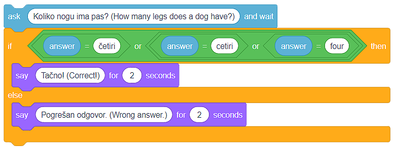
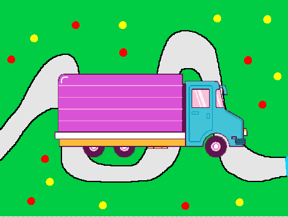

Degëzimi
===========

.. |IfElse| image:: ../_images/grananje/IfElse.png

.. |Or| image:: ../_images/grananje/Or.png
.. |Not| image:: ../_images/grananje/Not.png

Ne përmendëm se përsëritja e një ose më shumë komandave (blloqeve) është një koncept i fuqishëm në programim.

Po aq e dobishme dhe e rëndësishme është edhe koncepti i  **degëzimit së programit**. Degëzimi lejon që grupe të caktuara të blloqeve të ekzekutohen nga programi, ndërsa të tjerët jo. Cilat komanda do të ekzekutohen varet nga përmbushja e kushteve. Ju duhet ta kuptoni gjendjen si një deklaratë që mund të jetë **True** ose **False**.

Edhe pse, deri tani, ne kemi krijuar programe që drejtojnë komanda njëra pas tjetrës, nga fillimi deri në fund të programit, shumica e programeve përmbajnë degë.

Ekzistojnë dy blloqe për degëzim, dhe ato janë të vendosura në kategorinë **Control**:

• Blloku |If| kontrollon gjendjen dhe nëse gjendja është **True** ajo i bllokon blloqet e mbajtura brenda saj, dhe
• Blloku |IfElse| kontrollon gjendjen një nëse gjendja është  **True** ekzekuton një grup komandash, dhe nëse rezultati është **False** ekzekuton një grup tjetër.

.. |Jednako| image:: ../_images/grananje/Jednako.png
.. |ManjeOd| image:: ../_images/grananje/ManjeOd.png

Një mënyrë për të përcaktuar nëse një kusht është përmbushur është të zgjidhni, nga kategoria **Operators**, një nga **operatorët e krahasimit**:

•	më i madh se |VeceOd|; 
•	më i vogël se |ManjeOd|;
•	i barabartë me |Jednako|.

.. mchoice:: GrananjeZ1
   :answer_a: Si rezultat i ekzekutimit të skenarit A, programi do të shkruajë një fjali "Do të blej akullore!".
   :answer_b: Ekzekutimi i skenarit A dhe B do të ketë të njëjtin rezultat - programet do të shkruajnë një fjali "Unë do të blej akullore!".
   :answer_c: Si rezultat i ekzekutimit të skenarit B, programi do të shkruajë një fjali "Do të blej akullore!".
   :feedback_a: Shikoni me kujdes operatorin e krahasimit në skenarin A. Ne besojmë se mund të shihni që programi do të shkruajë fjalinë "Do të blej akullore!" vetëm nëse çmimi i akullores është më pak se 100 monedha.
   :feedback_b: Analizoni se si është përcaktuar operatori i krahasimit në skenarin A, dhe si është në skenarin B. Ne besojmë se mund ta shihni që në skenarin A, fjalia "Do të blej akullore!" do të shkruhet vetëm nëse çmimi i akullores është më pak se 100 monedha. Duke drejtuar skenarin B, fjalia "Unë do të blej akullore!" do të shkruhet nëse çmimi është më i vogël ose i barabartë me 100 monedha.
   :feedback_c: Shumë mirë! Programi do të shkruajë fjalinë "Unë do të blej akullore!" nëse çmimi është më i vogël ose i barabartë me 100 monedha.
   :correct: c

   Cmimi i akullores është 100 monedha. Analizoni skriptet e paraqitura në figurë dhe zgjidhni fjalinë e saktë.
   .. image:: ../_images/grananje/Sladoled.png
      :align: center

Mënyra më e lehtë për të kuptuar degëzimin është krijimi i një programi që simulon një kuiz. Kur i bëjmë përdoruesit një pyetje dhe presim përgjigjen e tij / saj, pritet që të sigurojmë përgjigje nëse përgjigja ishte e saktë apo jo. Ne mund të japim informacione rreth saktësisë së një përgjigje kur përcaktojmë nëse përgjigja e përdoruesit është identike me përgjigjen e saktë.

   .. image:: ../_images/grananje/Kviz1.png
       :align: center

Edhe pse duket se ne e kemi shkruar saktë kodin, dhe përgjigjen e saktë të pyetjes "Sa këmbë ka një qen?" është 4, përdoruesi mund të përgjigjet në pyetjen duke shtypur një varg në vend të një numri. Me fjalë të tjera, përgjigjja e saktë e pyetjes nuk është vetëm 4, por gjithashtu:

• Çetiri;
• Çetiri;
• katër.

Është e qartë se duhet ta përcaktojmë gjendjen më me kujdes, d.m.th. të pranojmë çdo përgjigje të mundshme të saktë.

Ne mund ta kapërcejmë këtë situatë duke përdorur **operatorët logjikë**, të cilat mund t'i gjejmë në kategorinë **Operators**:

• dhe |And|;
• ose |Or|;
• jo |No|.

Në rastin tonë, përgjigja e saktë mund të jetë **4 ose četiri ose cetiri ose katër**. Kjo është arsyeja pse ne do të përdorim operatorin |Or| disa herë për të përcaktuar gjendjen.

.. |Uradi| image:: ../_images/Uradi.png

|Uradi| Fëmijët janë mësuar të bëjnë pajisjet e ekranit me prekje. Ata nuk janë veçanërisht të aftë kur bëhet fjalë për përdorimin e një miu. Ne do t'i ndihmojmë ata të zhvillojnë këtë aftësi duke krijuar një program me një sprite kamionësh dhe një rrugë si sfond. Kamioni duhet të ndjekë treguesin e mouse të përdoruesit dhe të shkojë nga ana e majtë në anën e djathtë të skenës. Në rrugën e saj, kamioni nuk duhet të prek buzë rrugës. Nëse kamioni prek buzë në çdo pikë, ai do të kthehet në pozicionin e tij origjinal (pozicioni fillestar në fillim të udhëtimit në anën e majtë të skenës - **x: -226**, **y: -41**). Për krijimin e këtij programi, ju rekomandojmë të përdorni projektin *Journey*, të cilin mund ta gjeni |https://scratch.mit.edu/projects/326419371/|.

.. |https://scratch.mit.edu/projects/326419371/| raw:: html

 <a href="https://scratch.mit.edu/projects/326419371/" target="_blank">https://scratch.mit.edu/projects/326419371/</a>

Siç mund ta shihni, Sprite Truck është shumë e madhe për rrugën e ngushtë të tërhequr në sfondin e skenës që po përdorim në këtë program. Ju gjithashtu mund të shihni se rruga është e bardhë dhe se një linjë e zezë po e ndan rrugën nga bari. Ju duhet t'i mbani mend këto gjëra nëse dëshironi ta krijoni këtë program më vete.

.. reveal:: sakrivanjeGrananje1
   ::showtitle: Shiko zgjidhjen e mundshme
   :hidetitle: Fshih zgjidhjen
 
   **Possible solution**
     
   .. image:: ../_images/grananje/Putovanje1.png 
	:align: center

.. |Izazov| image:: ../_images/Izazov.png

|Izazov| Do të ishte mirë nëse programi ynë mund të matë sa kohë i duhet përdoruesit të "sjellë" kamionin deri në fund të rrugës. Përditësoni programin duke shtuar skenarin, i cili do të matë kohën që i duhet përdoruesit për të "kryer udhëtimin".

.. reveal:: sakrivanjeGrananje2
:showtitle: Shiko zgjidhjen e mundshme
:hidetitle: Fshih zgjidhjen

   **Possible solution**
     
   .. image:: ../_images/grananje/Putovanje2.png 
	:align: center

|Izazov| Duke përdorur konceptet dhe teknikat e treguara në këtë dhe mësimet e mëparshme, krijoni një program që simulon futjen e fjalëkalimit kur punoni në një kompjuter. Lërini programin të lejojë përdoruesin të futë fjalëkalimin tri herë. Nëse përdoruesi nuk arrin të shkruajë fjalëkalimin e saktë, programi do të ndalojë së punuari. Nëse përdoruesi ka sukses, sprite do të ndryshojë kostumin e saj. Ne ju rekomandojmë të përdorni projektin, të cilin mund ta gjeni në linkun e mëposhtëm |https: //scratch.mit.edu/projects/326403173/|, ku vendosim sprite Laptopi që ka dy kostume. Paç fat!

.. |https://scratch.mit.edu/projects/326403173/| raw:: html

 <a href="https://scratch.mit.edu/projects/326403173/" target="_blank">https://scratch.mit.edu/projects/326403173/</a>

.. reveal:: sakrivanjePonavljanje1
   :showtitle: Shiko zgjidhjen e mundshme
   :hidetitle: Fshih zgjidhjen
 
   **Zgjidhja e mundshme**
     
    Do të gjeni zgjidhjen tonë në projektin **Zgjidhjen e fjalëkalimit**, në |https: //scratch.mit.edu/projects/326417414/|. Ne ju rekomandojmë të rimendoni projektin dhe të shpjegoni zgjidhjen tonë duke përdorur komente. Ne e dimë që ju mund ta bëni!

.. |https://scratch.mit.edu/projects/326417414/| raw:: html

 <a href="https://scratch.mit.edu/projects/326417414/" target="_blank">https://scratch.mit.edu/projects/326417414/</a>
