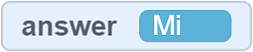
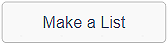

Listat
--------

.. |AnswerMima| image:: ../_images/promenljive/AnswerMima.png
.. |VAnswer| image:: ../_images/promenljive/VAnswer.png

.. |Emotikoni| image:: ../_images/liste/Emotikoni.png
.. |Uradi| image:: ../_images/Uradi.png

.. mchoice:: Liste Zadatak
   :answer_a: Variablat ruajnë shumë informacione (numra, vargjet, vlerat e vërteta ose false)
   :answer_b: Variablat ruajnë vetëm një pjesë të informacionit (një numër, një varg, vlera e vërtetë ose e rreme)
   :correct: b
   :feedback_a: Mendoni për përgjigjen tuaj. Nëse akoma mendoni njësoj, krijoni këto programe në Scratch dhe drejtojini ato. Mos harroni të rregulloni në mënyrë që vlerat e variablave të mund të shihen në skenë.
   :feedback_b: Saktë! Edhe pse ato janë të ndryshme, ekzekutimi i të dy programeve ka të njëjtin rezultat.

   Ne kemi krijuar ndryshoren |Answer|. Në një moment, vlera e kësaj ndryshore është |AnswerMima|, dhe në një pikë tjetër, vlera e saj është |AnswerMi|. Zgjidhni fjalinë e saktë:

Në procesin e krijimit të një programi, programuesit shpesh duhet të ruajnë shumë të dhëna (numrat e telefonit, emrat e produkteve, adresat, etj.). Në këto situata, variablat që kemi përdorur deri më tani nuk janë shumë të dobishme.

Për shkak të këtyre situatave, të cilat me siguri do t’i hasni në programimin tuaj të ardhshëm, ju paraqesim **listën**.

Një listë është një koleksion i të dhënave. Mund ta shikoni si një "fletore" që përmban një numër të madh "faqesh". Çdo "faqe" ka një numër (nga 1 e tutje) dhe një pjesë e informacionit shkruhet (ruhet) në secilën prej "kutive".

Një listë krijohet në kategorinë **Variables**, duke klikuar në butonin |MakeList| Një listë mund t'i referohet një ose të gjitha pjesëve në një program. Elementet e listës futen duke klikuar në shenjën **+** dhe vlerat e shkrimit në fushat përkatëse.

.. image:: ../_images/liste/NewList.png  
   :align: center
   
Për dallim nga variablat *e rregullt*, të cilat merren duke treguar emrin e tyre, secila artikull nga një listë mund të merret "thirrur" duke treguar numrin (pozicionin) e tyre në listë.

Lista |Emotikoni| përmban 5 artikuj - simbolet e tekstit që përshkruajnë shprehjet e fytyrës. Nëse duam që macja të thotë se si WINKING mund të përshkruhet duke përdorur simbole, duhet të bëjmë listën e mëposhtme:

.. image:: ../_images/liste/KodEmo.png   
   :align: center

Ne e bëmë të njëjtin kuiz duke përdorur *variabla të rregullta* dhe lista. Analizoni shkrimet e tyre:

.. image:: ../_images/liste/2Kviza.png  
   :align: center

|Uradi| Programet Remix A dhe B, të cilat mund të gjenden në A: |https://scratch.mit.edu/projects/326482978/| dhe B: |https://scratch.mit.edu/projects/326477714/|, duke shtuar të paktën tre pyetje në lidhje me ndjenjat dhe emocionet që i përfaqësojnë ato. Ne nuk kemi dyshim se do të vini re se sa kohë kursejmë duke përdorur listat në vend të variablave.

.. |https://scratch.mit.edu/projects/326482978/| raw:: html

 <a href="https://scratch.mit.edu/projects/326482978/" target="_blank">https://scratch.mit.edu/projects/326482978/</a>

.. |https://scratch.mit.edu/projects/326477714/| raw:: html

 <a href="https://scratch.mit.edu/projects/326477714/" target="_blank">https://scratch.mit.edu/projects/326477714/</a>

