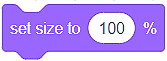
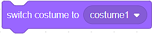
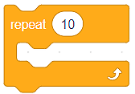
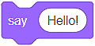
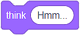

Pamje
======

Në Scratch, sprites kanë një ose më shumë kostume. Mundësia për të ndryshuar kostumet na jep mundësinë për të krijuar programe interesante dhe animacione. Për këtë qëllim, ne përdorim blloqet nga kategoria **Looks**.

Të menduarit, të folurit, ndryshimi i madhësive, ndryshimi i kostumeve
-------------------------------------------------- ---------

Ne do të krijojmë një program të quajtur Farm, i cili ka dy sprites - një vajzë Avery dhe një Zog. Ne do t'i vendosim ato në mjedisin e një ferme (Farm backdrop). Do ta vendosim qiqra në dorën e vajzës. Vajza do të "ushqejë" zogun dhe do ta shikojë të rritet.

.. image:: ../_images/izgled/Farma.png
   :width: 900px   
   :align: center

Do të fillojmë me skenarin e vajzës. Për vajzën, ne duam:

1. Madhësia e saj të jetë 50% më e madhe se madhësia origjinale (150%);
2. Ajo të mendojë "Sa bukur ..."
3. Ajo të thotë: "Shko, shko!"

Ne do ta vendosim zogun në dorën e saj. Për pulën, duam:

1. Madhësia e saj të jetë 50% më e vogël se madhësia origjinale (50%);
2. Ajo për të simuluar një lëvizje pecking;
3. Madhësia e saj të rritet gjatë ekzekutimit të programit.

.. image:: ../_images/izgled/KodFarma.png
   :width: 1200px   
   :align: center

.. reveal:: sakrivanjeFarma
   :showtitle: Shikoni udhëzuesin për krijimin e programit Farm
   :hidetitle: Fshih videon

**Shikoni procesin e krijimit të programit, i cili lejon që sprites të mendojnë, të flasin dhe të ndryshojnë madhësinë dhe kostumet e tyre:**
     
   .. youtube:: VIDEO1
      :width: 735
      :height: 415
      :align: center

Siç mund ta shihni, ne kemi përdorur disa blloqe nga kategoria **Looks** për të krijuar programin tonë Farm:

• Ne rregulluam madhësinë e sprites duke përdorur bllok |Size|;
• Ne ndryshuam madhësinë e sprites duke përdorur bllok |SizeBy|;
• Ne shfaqëm mendimet e sprite duke përdorur bllokun |Think2s|;
• Ne shfaqëm mendimet e sprite duke përdorur bllokun |Say2s|;
• Ne ndryshuam kostumet e sprite duke përdorur bllokun |Switch|
  

.. |SizeBy| image:: ../_images/izgled/SizeBy.png
.. |Think2s| image:: ../_images/izgled/Think2s.png
.. |Say2s| image:: ../_images/izgled/Say2s.png

Përveç gjithçkaje të përmendur më lart, blloku |Repeat10| ishte vendimtare për funksionimin e duhur të programit tonë. Përsëritja është një koncept i fuqishëm sepse e bën kodin më të shkurtër, më të qartë dhe më të lehtë për të debuguar. Duke përdorur përsëritjen, ne lejuam që pulë të "lëvizë", d.m.th. kemi siguruar përsëritjen e komandës që ndryshon kostumin. Blloqet e përsëritjes janë të vendosura në kategorinë **Control**. Kjo kategori përmban blloqe të rëndësishme të përdorura për kontrollin e rrjedhës së programit.

|Uradi| Krijoni një program, i cili do të simulojë funksionimin e një semafori. **Ndihmë e vogël**: Dritat në një semafor nuk ndryshojnë me të njëjtën shpejtësi. Dritat e kuqe dhe jeshile qëndrojnë më gjatë se e verdha.

.. reveal:: sakrivanjeSemafor
   :showtitle: Shikoni udhëzuesin për krijimin e programit Drita e trafikut
   :hidetitle: Fshih videon
 
   **Watch the process of creating the program, which allows you to simulate the functioning of a traffic light:**
     
   .. youtube:: VIDEO2
      :width: 735
      :height: 415
      :align: center

.. |SwBcdrop| image:: ../_images/izgled/SwBcdrop.png
.. |Show| image:: ../_images/izgled/Show.png
.. |Hide| image:: ../_images/izgled/Hide.png

.. mchoice:: IZadatak1
   :answer_a: Siguron që mendimet e sprite të mbeten në skenë.
   :answer_b: Siguron që mendimet e sprite të ndryshojnë vazhdimisht.
   :feedback_a: Ju keni absolutisht të drejtë!
   :feedback_b: Për të bërë të mundur që mendimet të ndryshojnë vazhdimisht, duhet të përdorni bllokun e duhur për të përsëritur komandën për shfaqjen e mendimeve të sprite.
   : e saktë: a

   Ne tërheqim vëmendjen tuaj për ekzistencën e blloqeve që ekzekutojnë komanda të ngjashme me ato që kemi paraqitur në këtë mësim. Për shembull, blloku |Say| siguron që fjalimi i sprite nuk zhduket nga skena. Supozojmë se mund të konkludoni se cili është qëllimi i bllokut |Think|

Përveç se më sipër, kategoria **Show** përmban disa blloqe të tjera.

Në të njëjtën mënyrë ne mund të zgjedhim kostumet e sprite, gjithashtu mund të zgjedhim sfondin e skenës duke përdorur bllokun |SwBcdrop|
   
Blloqet që na lejojnë të tregojmë |Show| ose fsheh |Hide| një sprite janë gjithashtu shumë të dobishme. Ne do t'i përdorim këto blloqe në mësimet e mëposhtme.

Ne do t'ju lejojmë të zbuloni vetë se si mund të luani me ngjyrën dhe pamjen e spritës tuaj duke përdorur blloqe për ndryshimin e ngjyrës ose efektit (*change ... *), duke vendosur ngjyrën ose efektin (*set ... *) , si dhe për fshirjen e të gjitha efekteve grafike (*clear graphic effects*):
.. image:: ../_images/izgled/Color.png  
   :align: center