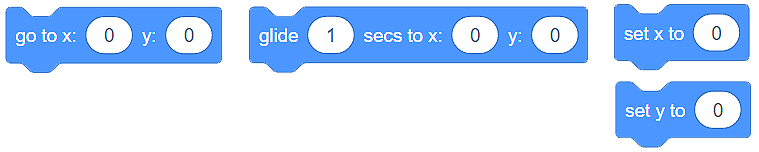
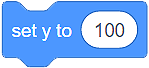
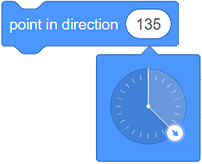
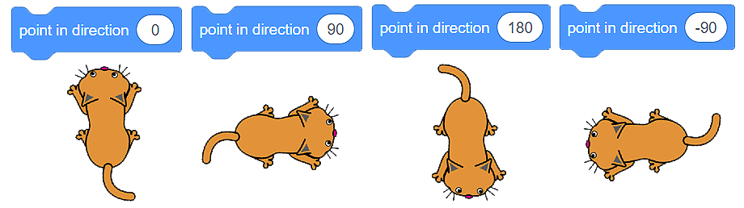
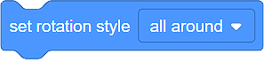
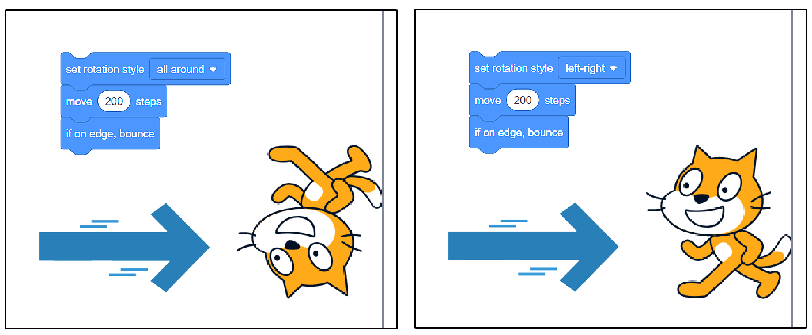
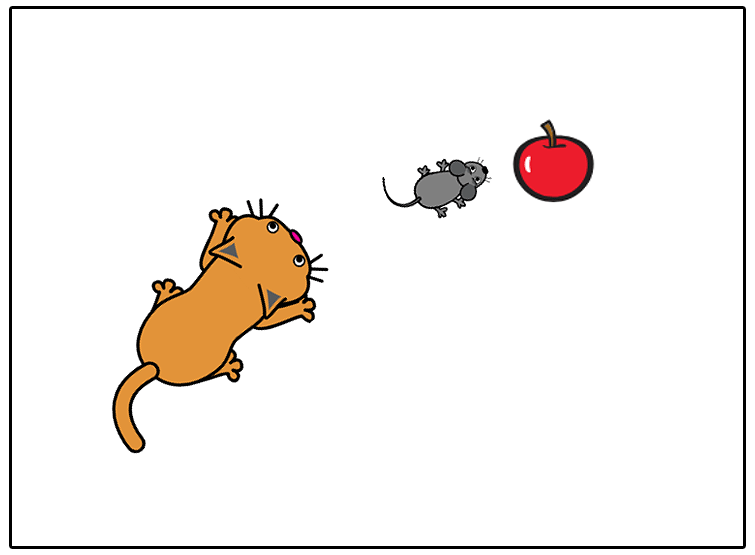

Lëvizja
========

Tashmë u njohët me ndërfaqen e përdoruesit Scratch, keni mësuar se si të krijoni sprites dhe të përcaktoni pozicionin e tyre në skenë. Tani është një kohë e përsosur për të mësuar se si t'i lëvizni duke përdorur komanda (blloqe) nga kategoria **Motion**. Këto blloqe do t'ju mundësojnë të bëni lojëra dhe animacione të thjeshta.

Ekzistojnë 3 lloje të blloqeve që mund të përdorni për të lëvizur spërkatjen tuaj:

• Bllokime për lëvizje absolute
• Bllokime për lëvizje relative
• Blloqe të tjera lëvizjeje

Blloqe për lëvizje absolute
-----------------------------

Në kategorinë **Motion**, ka 4 blloqe, të cilat mundësojnë lëvizje absolute.

Do t'i përdorni këto blloqe kur të keni nevojë për të programuar sprite-in tuaj për të kaluar në një lokacion specifik **(pikë) në skenë **.

.. infonote::

    **Macja po ndjek mausin ...**
        
     Macja është e vendosur në qendër të fazës, dhe miu është në pikë **(x:150 y:100)**. 

    .. image:: ../_images/kretanje/MM1.png 
       :width: 400px
       :align: center

    
    Ju kujtojmë që faza është një sipërfaqe drejtkëndëshe 480 pixel e gjerë dhe 360 pixel e lartë. Qendra ka koordinatat **(x:0 y:0)**.

.. |AK1| image:: ../_images/kretanje/AK1.png
.. |AK2| image:: ../_images/kretanje/AK2.png
.. |AK3| image:: ../_images/kretanje/AK3.png

Nëse dëshironi që macja të kapë miun thjesht mund të përdorni bllokun |AK1|.

.. image:: ../_images/kretanje/MM1a.png 
   :width: 400px   
   :align: center

Nëse dëshironi që ndjekja të zgjasë më shumë, mund të përdorni bllokun |AK2| Me këtë bllok macja do të rrëshqasë për 1 sekondë nga pika **(x:0 y:0)** tek pika **(x:150 y:100)**.

Duke përdorur blloqet |AK3| dhe |AK4| ju mund ta bëni atë të duket sikur macja ngadalë po vret miun:

.. image:: ../_images/kretanje/MM34a.png  
   :width: 800
   :align: center

Ju gjithmonë mund të shihni pozicionin aktual të sprite (vlerat aktuale të **x:** dhe **y:**) poshtë fazës, në listën e sprite.

.. image:: ../_images/kretanje/XY.png  
   :align: center

.. mchoice:: AKZadatak1
   :answer_a: Programi A
   :answer_b: Programi B
   :feedback_a: Te lumte! Macja "kapi" të gjithë minjtë!    
   :feedback_b: Hm .. Ne ju rekomandojmë që të lexoni me kujdes mësimin Pozicioni i sprite në skenë.
   :correct: a

   Analizoni pozicionin e minjve të paraqitur në figurën më poshtë dhe zgjidhni programin, i cili do të lejojë që macja të "kapë" të gjithë minjtë.

   .. image:: ../_images/kretanje/AKZ1.png
      :width: 700
      :align: center

.. |Vazno| image:: ../_images/Vazno.png

.. infonote::

    |Vazno|   **Kështu që, duke përdorur blloqet për lëvizje absolute, ju i tregoni burimit tuaj saktësisht se ku duhet të shkojë në skenë.**

Blloqe për lëvije relative
-----------------------------

Lëvizja relative nuk përcaktohet nga vendndodhja që duhet të shkojë sprite, por nga pozicioni aktual i sprite.

Në kategorinë **Lëvizja**, ju keni në dispozicion disa blloqe, të cilat mundësojnë lëvizje relative.

.. image:: ../_images/kretanje/RKBlokovi.png  
   :align: center

Në shembullin ku macja po ndiqte miun, ne e dinim vendndodhjen e saktë të miut (pika në të cilën ndodhet). Situatat ku ne nuk e dimë vendndodhjen e sprite janë më të zakonshme. Në këto raste, ne do të përdorim blloqe për lëvizje relative për të lëvizur sprite-n tonë.

Kur bëhet fjalë për lëvizje relative, është shumë e rëndësishme të tregoni (ktheni) sprite në drejtimin e dëshiruar. Ne e arrijmë këtë duke tërhequr shigjetën rreth rrethit të bllokut |RKS2|.

Është mirë që ju të dini që drejtimi drejt 0 përfaqëson lart, drejt 90 është në të djathtë, drejt 180 është poshtë, dhe në drejtim të -90 është në të majtë.

Mund të shihni gjithashtu drejtimin e tanishëm të sprite poshtë fazës, në listën e sprite në fushën ** Direction**.

.. image:: ../_images/kretanje/XY.png 
   :align: center

.. mchoice:: RKZadatak1
    :answer_a: Drejtimi: 90 (djathtas) Pozicioni: (x: 50 y: -100)
    :answer_b: Drejtimi: 180 (poshtë) Pozicioni: (x: 50 y: 100)
    :feedback_a: Analizoni përsëri programin. A e ndryshon kthesën e sprite 90 gradë?
    :feedback_b: Shumë mirë! Ju e kuptoni mirë lëvizjen e sprite!
    :e saktë: b

    Analizoni programin e paraqitur në figurë, dhe zgjidhni atë që mendoni se është drejtimi i sprite, si dhe cili do të jetë pozicioni i tij pasi programi të mbarojë së ekzekutuari.

   .. image:: ../_images/kretanje/RKZ1.png
      :align: center

.. infonote::

    |Vazno|   **Pra, duke përdorur blloqe për lëvizje relative, ju i thoni sprite ku të tregojë dhe lëvizë në lidhje me pozicionin e tij aktual.**

Të tjera blloqe lëvizje
--------------------------

Në kategorinë **Motion**, ju keni në dispozicion edhe 4 blloqe të tjera, të cilat mundësojnë lëvizjen e sprites.

.. image:: ../_images/kretanje/OKBlokovi.png   
   :align: center

.. |OK3| image:: ../_images/kretanje/OK3.png

.. |OK4b| image:: ../_images/kretanje/OK4b.png

Skena është një hapësirë e kufizuar. Kur sprite arrin skajin e skenës, do të ishte e natyrshme që ajo të kthehet dhe të vazhdojë të lëvizë në një drejtim tjetër. Ju do të mundësoni këtë sjellje të sprite duke përdorur bllokun |OK3|. Ju gjithashtu do të vendosni se si sprite vazhdon të lëvizë. Nëse brenda bllokut |OK4a| e vendosni stilin e rrotullimit të sprite në **rreth**, do të vazhdojë të lëvizë kokëposhtë. Kjo nuk do të ndodhë nëse, nga lista rënëse e bllokut, ju zgjidhni opsionin majtas-djathtas |OK4b|.

Ju gjithmonë mund të shihni stilin aktual të lëvizjes së sprite tuaj nën fazën në listën e sprite, në fushën **Direction**.

.. image:: ../_images/kretanje/XY.png
   :width: 400px   
   :align: center

Le të kthehemi te spritet tona: |macka| and |mis|. 

.. |OK1| image:: ../_images/kretanje/OK1.png
.. |OK1a| image:: ../_images/kretanje/OK1a.png
.. |macka| image:: ../_images/kretanje/macka.png
.. |mis| image:: ../_images/kretanje/mis.png

Nëse nuk e dimë pozicionin e saktë të miut, dhe duam që macja të drejtohet drejt tij (të drejtohemi drejt tij), mund të përdorim bllokun |OK1|. Thjesht duhet të zgjedhim Sprite Mouse |OK1a| nga lista e lëshuar, dhe problemi është zgjidhur.

Ne do t'ju tregojmë se si funksionojnë dy blloqet e fundit në shembullin e mëposhtëm.

.. infonote ::

     **Macja po ndjek mausin ...**
        
     Macja po ndjek mausin, duke rrëshqitur drejt tij. Miu vazhdimisht kthehet dhe shkon drejt kursorit, të cilin po lëvizim nëpër skenë.

    .. image:: ../_images/kretanje/OKPR1.png   
       :align: center

    
      Mbi secilën nga sprites janë skriptet që mundësojnë sjelljen e përshkruar.

.. |Izazov| image:: ../_images/Izazov.png

|Izazov| Përditësoni programin e paraqitur më sipër duke shtuar një tjetër sprite - një mollë. Kërkoni miun të ndjekë mollën dhe macja të ndjekë miun. Bëni mollën të lëvizë drejt kursorit (të cilin ne e kontrollojmë), miu duhet të lëvizë drejt mollës, dhe macja duhet të lëvizë drejt miut.

.. reveal:: sakrivanjeKretanje
   :showtitle: Krahaso zgjidhjen tuaj me tonën
   :hidetitle: Fshih zgjidhjen
 
   **Zgjidhje e mundshme:**
     
   .. youtube:: QgCCzBw6DKU
      :width: 735
      :height: 415
      :align: center
   
   
