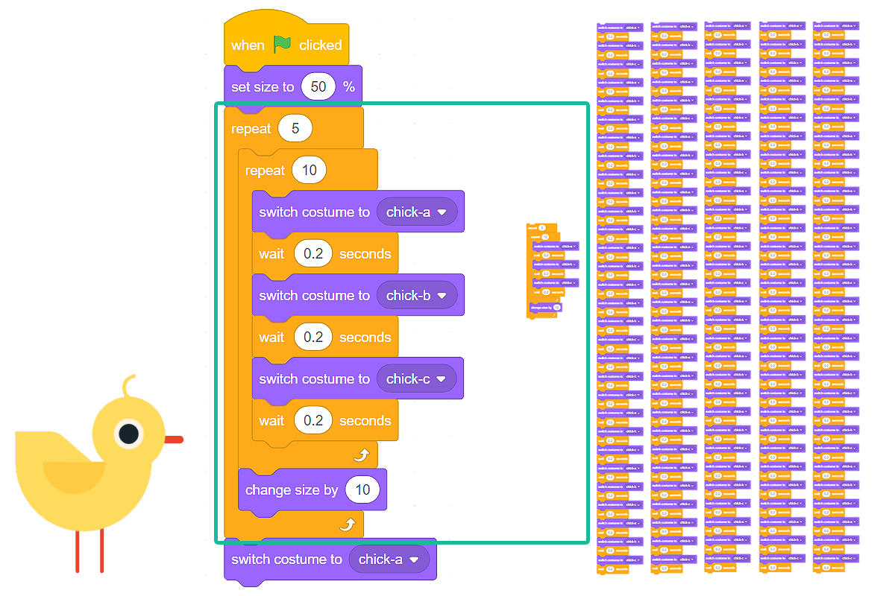
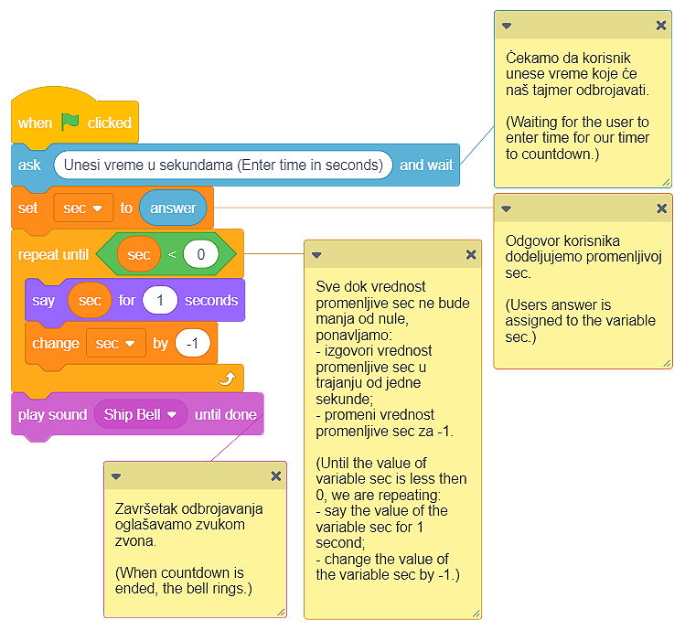

Përsëritje
===========

Ne kemi përmendur tashmë se përsëritja e një ose më shumë komandave (blloqeve) është një koncept i fuqishëm në programim. Kur disa nga komandat ekzekutohen shumë herë në një program, ne themi se programi përmban **sythe**. Ne e kemi përdorur këtë koncept disa herë më parë.

.. |Repeat10| image:: ../_images/ponavljanje/Repeat10.png
.. |RepeatF| image:: ../_images/ponavljanje/RepeatF.png
.. |RepeatU| image:: ../_images/ponavljanje/RepeatU.png

Në Scratch, ne kemi 3 lloje të blloqeve që përsërisin komandat:

• Blloku që përsërit komandat një numër specifik kohësh;
• Blloku që përsërit komandat një numër të pafund kohërash;
• Blloku që përsërit komandat derisa të përmbushet një kusht specifik.

Ne do të futim blloqet që duhet të përsërisim në një nga këto blloqe.

Blloku që përsërit komandat një numër specifik kohësh
-----------------------------------------------------------

.. |Uradi| image:: ../_images/Uradi.png
.. |Repeat10a| image:: ../_images/ponavljanje/Repeat10a.png
.. |Repeat5| image:: ../_images/ponavljanje/Repeat5.png

.. image:: ../_images/ponavljanje/Repeat10.png
   :align: center

Ne përdorëm bllokun që përsërit komandat një numër specifik kohësh në projekt *Farm* (mund të gjesh më shumë informacion në mësim *Looks*).

Zogu i pulave në program ishte duke simuluar lëvizjen e pekingut duke ndryshuar kostumet a, b dhe c 10 herë. Pas këtij simulimi, zogthi u rrit në madhësi me 10. Qëllimi ynë ishte të rritnim madhësinë e mishit të pulës me 50, kështu që përsërisnim pjesën e kodit që rriti madhësinë e spriteve 5 herë. Për të arritur sjelljen e dëshiruar, kemi përdorur blloqet |Repeat10a| dhe |Repeat5|.

Në figurën më poshtë, ne copëtuam pjesën e skenarit që lidhet me përsëritjen e komandave, dhe kemi bërë të njëjtin program, por këtë herë pa përdorur blloqet e përsëritjes. Skenari që morëm ishte me të vërtetë i gjatë, kështu që për qartësi, duhej ta ndanim në pesë kolona.

|Uradi| Krijoni programin *Farm* pa përdorur blloqet për përsëritje. Krahasoni kodin tuaj me tonën. Ne besojmë se ju mund të shihni se grumbullimi i grupeve identike të blloqeve e bën programin më të gjatë, më të vështirë për tu kuptuar dhe azhornuar.

Blloku që përsërit komandon një numër të pafund kohërash
------------------------------------------------------------

.. |StopAll| image:: ../_images/ponavljanje/StopAll.png

.. |StopOS| image:: ../_images/ponavljanje/StopOS.png

.. image:: ../_images/ponavljanje/RepeatF.png
   :align: center

Ky bllok për përsëritjen e komandave drejton një numër të pafund herë. Drejtimi i këtij blloku nuk ndalet kurrë më vete. Ne duhet ta ndalojmë atë duke klikuar butonin, i cili ndalon programin (butoni i kuq pranë flamurit të gjelbër) ose duke përdorur një nga blloqet e mëposhtëm |StopAll| / |StopTS| / |StopOS|, nga kategoria **Control**.

Ne përdorëm bllokun që përsërit komandat një numër të pafundmë herë në projekt *Macja po ndjek miun* (mund të gjesh më shumë informacion në mësimin *Move*).

.. mchoice:: PonavljanjeZ1
   :answer_a: Blloqet e reja mund të futen në bllok vetë, kështu që nuk ka nevojë të vazhdojë skenarin.
   :answer_b: ashtë një gabim në Scratch. Blloku për përsëritje të pafund duhet të ketë një mundësi për vazhdimin e skenarit.
   :answer_c: Shtimi i blloqeve është i kotë sepse ata kurrë nuk do të kandidonin
   :feedback_a: Mundësia për të futur blloqe të reja në bllok |RepeatF| nuk ofron mundësinë për të grumbulluar skriptet që nuk do të përsëriten kurrë, ajo thjesht shton komanda që do të përsëriten një numër të pafund kohërash.
   :feedback_b: Sa ka të ngjarë që një nga blloqet më të përdorura në Scratch nuk është ndërtuar siç duhet? Ne ju sugjerojmë të mendoni përsëri për pyetjen dhe të jepni një përgjigje të re.
   :feedback_c: Përfundim i shkëlqyeshëm, i bërë mirë!
   :correct: c

   Analizoni paraqitjen e blloqeve për komandat përsëritëse. Ju mund të shihni që blloku, i cili përsërit komandat një numër të pafund kohërash, nuk ka mundësinë të lidhet me blloqe të tjera, d.m.th. nuk mund të shtoni një bllok tjetër mbi të. Pse?
   

Blloku që përsërit komandat derisa të përmbushet një kusht specifik
-------------------------------------------------------------------------

.. |VSec| image:: ../_images/ponavljanje/Vsec.png

.. image:: ../_images/ponavljanje/RepeatU.png
   :align: center

Ky bllok për përsëritjen e komandave shkon derisa të përmbushet një kusht i caktuar. Skriptet brenda këtij blloku ekzekutohen bazuar në një provë, e cila përcakton nëse gjendja e vendosur në bllok është e vërtetë apo jo. Ne e përdorim këtë bllok kur nuk e dimë se sa herë duhet të përsërisim komandat brenda bllokut për përsëritje, dhe për këtë arsye, duam që ata të ekzekutojnë derisa të përmbushet një gjendje e caktuar.

.. mchoice:: PonavljanjeZ2
   :answer_a: Blloku që përsërit komandat një numër specifik kohësh.
   :answer_b: Blloku që përsërit komandat një numër të pafund kohërash.
   :answer_c: Blloku që përsërit komandat derisa të përmbushet një kusht specifik.
   :feedback_a: Nëse ju zgjidhni këtë bllok, raketat e qitjes nuk kanë asnjë lidhje me nivelin e energjisë së sprite tuaj, a është kjo?
   :feedback_b: Nëse ju zgjidhni këtë bllok, raketat e qitjes nuk kanë asnjë lidhje me nivelin e energjisë së sprite tuaj, a është kjo?
   :feedback_c: Ju keni të drejtë! Numri i përsëritjeve varet nga përmbushja e kushteve. Në momentin që niveli i energjisë së sprite tuaj bie nën një vlerë të caktuar, raketat e qitjes do të ndalen.
   :correct: c

   Ju dëshironi të krijoni një program ku avioni juaj (top breshëri) po qëllon raketa në retë breshër derisa niveli i tij i energjisë të bjerë nën një vlerë të caktuar. Cilin bllok për përsëritjen e komandave do të përdorni?

Ne do të demonstrojmë se si një bllok *që përsërit komandat derisa të përmbushet një gjendje specifike* - do të krijojmë një program që funksionon si një kohëmatës, d.m.th. ai numëron sekonda nga vlera e futur në zero.

Për këtë program, ne do të krijojmë variablin |VSec|, e cila do të ruajë vlerën e sekondave të mbetura ndërsa kohëmatësi po numëron. Ne do t'i kërkojmë përdoruesit të fusë një numër të caktuar sekondash. Pastaj, do të fillojmë numërimin. Pasi të ketë mbaruar koha e futur, ne do të dëgjojmë një sinjal të shëndoshë.

Shifra më poshtë përmban sugjerimin tonë për kodin e programit me komente, të cilat shërbejnë si një shpjegim. Programuesit e gjykojnë të dobishëm të komentojnë skriptet dhe të shpjegojnë se çfarë bëjnë blloqe të caktuara. Të komentuarit ua lehtëson programuesve të tjerë të kuptojnë dhe azhurnojnë programet që krijojmë. Mund të shtoni një koment duke klikuar me të djathtën në skenar, dhe duke zgjedhur opsionin **Add comment**.

Programi *Timer* mund të gjendet në linkun |https://scratch.mit.edu/projects/326420353|. Përditësoni atë duke shtuar një tingull të akrepave të orës, i cili do të dëgjohet ndërsa ora kalon.

.. |https://scratch.mit.edu/projects/326420353| raw:: html

 <a href="https://scratch.mit.edu/projects/326420353" target="_blank">https://scratch.mit.edu/projects/326420353</a>
