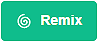
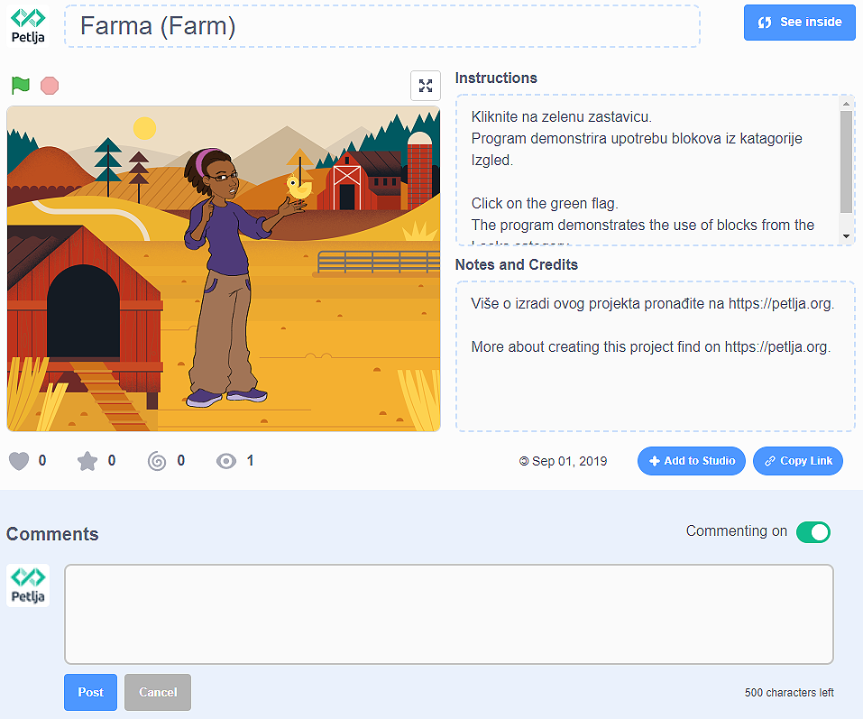

Gjuha e progamimit vizual Scratch 
=====================================

Scratch është një gjuhë vizuale e programimit e krijuar për fëmijët. Programimi në Scratch nuk kërkon komanda për të shkruar. Për të krijuar një program, thjesht mund të organizoni **blloqet** në rregullin e duhur (të ngjashme me enigmat ose LEGO).

Rezultati i programit, i cili përmban vetëm një komandë |BWelcome| duket kështu: |Welcome|
  .. |BWelcome| image:: ../_images/scratch/BWelcome.png
  .. |Welcome| image:: ../_images/scratch/Welcome.png

këtu janë dy mënyra se si mund të përdorim Scratch (version 3):

• duke shkarkuar skedarin e instalimit nga |https: //scratch.mit.edu/download| dhe instalimi i tij në pajisjen tuaj dixhitale personale (versioni desktop i programit);
• duke punuar në internet në faqen e internetit |https: //scratch.mit.edu| (versioni në internet i programit).

.. |https://scratch.mit.edu/download| raw:: html

 <a href="https://scratch.mit.edu/download" target="_blank">https://scratch.mit.edu/download</a>

.. |https://scratch.mit.edu| raw:: html

 <a href="https://scratch.mit.edu" target="_blank">https://scratch.mit.edu</a>

Të dyja mënyrat kanë avantazhet dhe disavantazhet e tyre.

Nëse instalojmë versionin e desktopit në pajisjen tonë dixhitale personale, do të punojmë më shpejt dhe më të rehatshme, kryesisht sepse nuk do të varet nga cilësia e lidhjes sonë në internet, ose nga mirëmbajtja e herëpashershme e platformës në internet Scratch (e cila më pas është e padisponueshme).

Nëse po programojmë duke përdorur platformën në internet Scratch, duhet të krijojmë llogarinë tonë personale. Me të pasur llogari vjen aftësia për të ruajtur projektet tona në platformën online dhe për t'iu qasur atyre nga çdo pajisje e lidhur në Internet. Përveç kësaj komoditeti, platforma në internet Scratch ju ofron mundësinë e mbajtjes së pjesëve të programeve tuaja të **shpinës** dhe i përdorni përsëri kur ju duhen. Një avantazh shtesë është aftësia për të publikuar programe. Pas publikimit, programi juaj bëhet i dukshëm për përdoruesit e tjerë Scratch; ne i quajmë ata **Scratchers**. Ashtu si ata mund të shohin dhe rimodukojnë (adaptojnë) programet (projektet) tuaja, gjithashtu mund t'i shihni dhe shihni të tyret. Mund të kërkoni ndihmë edhe në platformë. Ndihma për Scratchers të tjerë është në frymën e këtij komuniteti në internet.
 
Ndërfaqja e përdoruesit e dy versioneve të ndryshme të Scratch duket pothuajse identike; megjithatë, versioni në internet ka të gjithë elementët e versionit të instaluar dhe disa funksionalitete të tjera. Në këtë faqe, ne do të tregojmë elementet e platformës në internet Scratch.

Scratch Platforma Online
-------------------------

Programet që janë krijuar në platformën në internet Scratch quhen *projects*. Projektet krijohen duke klikuar në butonin **Create**. Kjo do të hapë ndërfaqen e përdoruesit, e cila duket si kjo:

.. image:: ../_images/scratch/RadnoOkruzenje.png   
   :align: center

1. Menu bar;

2. Faqet **Code**, **Costumes** dhe **Sounds**;

3. Përzgjedhja e kategorive të bllokut që mund të shtohen në sipërfaqen e punës;

4. Hapësira ku ne mund të krijojmë programet tona (grumbullojmë blloqet tona), të cilat lidhen me spritin aktiv (karakterin) ose skenën;

5. Paketë shpine;

6. Lista Sprite me parametra bazë (karakteristikat) - spraiti aktiv shënohet nga një kornizë blu rreth figurës së saj;

7. Lista e sfondeve fazore;

8. Etapa.

| SLogo | Titulli i ndërfaqes është i zënë nga shiriti *Menu Bar*.

  .. |SLogo| image:: ../_images/scratch/SLogo.png 

.. image:: ../_images/scratch/LinijaMenija.png   
   :align: center

1. . Duke klikuar në **Scratch** do të hapet faqja e llogarisë së përdoruesit që është regjistruar aktualisht (në rastin tonë kjo do të ishte faqja e llogarisë Loop). Brenda kësaj faqe, ju mund të shihni njoftimet përkatëse, lajmet, projekt-propozimet e Scratchers të tjerë, si dhe të gjitha mesazhet e marra (**Mesazhet**), dhe programet e bëra nga pronari i llogarisë (**My Stuff**).

2. Duke klikuar në ikonën Earth do të hapet një listë drop-down nga e cila mund të zgjedhim gjuhën në të cilën do të shfaqen të gjithë elementët e ndërfaqes së përdoruesit;

3. **File** ofron disa mundësi të rëndësishme: fillimi i një projekti të ri (**New**), kursimi i një projekti (**Save now**), duke kursyer një projekt si një kopje të një tashmë ekzistuese (**Save as copy**), duke ngarkuar një program nga kompjuteri juaj personal (**Ngarko nga kompjuteri juaj**) dhe shkarkoni projektin në kompjuterin tuaj personal (**Ruani në kompjuterin tuaj**);

4. **Redaktimi** na lejon të rivendosim një sprite të fshirë me të gjitha blloqet e saj (**Rivendosja **), si dhe të ndizni mënyrën turbo për ekzekutimin e programit (**Ndizni modalitetin e turbo**). Nëse nuk duam që programi të funksionojë shpejt, thjesht mund të fikim modalitetin turbo (**Fikni modalitetin e turbo**);

5. Duke klikuar në **Tutorials** do të hapet një faqe ku mund të zgjedhim një nga udhëzimet se si të krijojmë programe në Scratch;

6. Në këtë fushë do të shkruajmë emrin e projektit;

7. Klikimi i butonit **Share** do ta bëjë projektin tonë publikisht të disponueshëm për Scratchers të tjerë. Kjo është kur faqja për atë projekt të veçantë është krijuar;

8. **Shikoni faqen e projektit** na çon në faqen e projektit tonë ku duhet të futemi: udhëzime se si të përdorim programin (**Udhëzimet**), dhe shënimet dhe informacionet rreth krijuesve (**Shënime dhe kredite**). Në këtë faqe ne mund të drejtojmë programin, si dhe të kthehemi në mjedisin e programimit, duke klikuar në butonin **Shih brenda**.

9. Duke klikuar në ikonën e skedarit (**My Stuff**) do të hapet faqja me të gjitha programet e krijuara nga përdoruesi që është regjistruar.

|SLogo| Pjesa qendrore e ndërfaqes së përdoruesit është e zënë nga skedarët *Code*, *Costums* dhe *Sounds*.

.. image:: ../_images/scratch/RadnoOkruzenje.gif   
   :width: 800px
   :align: center

1. 1. Skeda *Code* përmban kategori komandash me blloqe të listuara, të cilat u takojnë atyre (ngjyra e bllokut korrespondon me ngjyrën e kategorisë që i përket). Këto blloqe janë të lidhura me sprite aktive dhe hapësirën programuese në të cilën blloqet vendosen duke i zvarritur dhe hedhur ato në sipërfaqe;

2. Tab *Costums* përmban redaktorin me mjete për shtimin, fshirjen dhe përshtatjen e kostumeve që i përkasin sprite aktive;

3. Skeda *Sounds* përmban redaktorin me mjete për shtimin, fshirjen, luajtjen dhe përpunimin bazë të regjistrimeve audio.

|SLogo| Këndi i poshtëm i djathtë i skenës është i rezervuar për shtimin / fshirjen e sprites dhe sfondet e skenës. Sprites dhe sfondet skenike mund të shtohen nga biblioteka Sprite / Backdrop **Zgjidhni një Sprite / Backdrop**, ne mund t'i tërheqim ato **Paint**, mund të lejojmë që Scratch të na befasojë dhe të zgjedhë për ne një sprite / sfond **Surprizë**, si dhe ngarkoni ato nga kompjuteri ynë personal **Upload Sprite / Sfond**.

.. image:: ../_images/scratch/LikoviPozadine.png   
   :width: 800px
   :align: center

|SLogo| *Stage* është hapësira brenda së cilës programi është duke u ekzekutuar. Isshtë 480 hapa (pixel) i gjerë dhe 360 hapa (pixel) i lartë. Pozicioni i një sprite përcaktohet me dy vlera **x:** dhe **y:**.

• Vlera **x:** përcakton pozicionin e një sprite përgjatë gjerësisë së fazës (majtas ose djathtas);
• Vlera **y:** përcakton pozicionin e një sprite përgjatë lartësisë së fazës (lart ose poshtë);

.. image:: ../_images/scratch/XYBoja.png   
   :align: center

Prandaj, vlerat e **x:** dhe **y:** varen nga vendndodhja e sprite. Nëse duam që sprita jonë të jetë në qendër të fazës, vlerat duhet të jenë: **x: 0 ** dhe **y: 0**. Informacioni mbi vendndodhjen aktuale të sprite mund të shihet në listën e sprites, brenda parametrave të sprite.

.. mchoice:: OkruzenjeZadatak1
   :answer_a: : përgjigje_a: Në pjesën e sipërme të majtë të skenës.
   :answer_b: Në pjesën e poshtme të majtë të skenës.
   :answer_c: Në pjesën e sipërme të djathtë të fazës.
   :answer_d: Në pjesën e poshtme të djathtë të fazës.
   :feedback_a: Mirë! Ju e kuptoni në mënyrë të përsosur se si vlerat e X: dhe Y: përcaktoni pozicionin e sprite në skenë!
   :feedback_b: Studioni figurën ku e ndamë fazën në katër pjesë dhe i pikturuam ato me ngjyra të ndryshme. Do të vini re se në pjesën e gjelbër të fazës vlerat janë X> 0 dhe Y> 0; në pjesën e kuqe të fazës vlerat janë X <0 dhe Y> 0; në pjesën blu të fazës vlera është X <0 dhe Y <0; në pjesën e verdhë të fazës vlerat janë X> 0 dhe Y <0. A jeni tani në gjendje t’i përgjigjeni saktë pyetjes sonë?
   :feedback_c: Studioni figurën ku e ndamë fazën në katër pjesë dhe i pikturuam ato me ngjyra të ndryshme. Do të vini re se në pjesën e gjelbër të fazës vlerat janë X> 0 dhe Y> 0; në pjesën e kuqe të fazës vlerat janë X <0 dhe Y> 0; n pjesa blu e fazës vlera është X <0 dhe Y <0; në pjesën e verdhë të fazës vlerat janë X> 0 dhe Y <0. A jeni tani në gjendje t’i përgjigjeni saktë pyetjes sonë?
   :feedback_d: Studioni figurën ku e ndamë fazën në katër pjesë dhe i pikturuam ato me ngjyra të ndryshme. Do të vini re se në pjesën e gjelbër të fazës vlerat janë X> 0 dhe Y> 0; në pjesën e kuqe të fazës vlerat janë X <0 dhe Y> 0; n pjesa blu e fazës vlera është X <0 dhe Y <0; në pjesën e verdhë të fazës vlerat janë X> 0 dhe Y <0. A jeni tani në gjendje t’i përgjigjeni saktë pyetjes sonë?
   :e saktë: a

   Shikoni me kujdes informacionin në lidhje me pozicionin e sprite në skenë. Cili është vendndodhja e sprite?

   .. image:: ../_images/scratch/OkruzenjeZadatak1.png
      :align: center

Pjesëmarrës në Komunitetin Online Scratch
-----------------------------------------------

.. |Share| image:: ../_images/scratch/Share.png

.. |Report| image:: ../_images/scratch/Report.png

Pavarësisht nëse krijuam një program (projekt) në platformën Scratch online ose duke përdorur versionin e tij të desktopit, ne mund ta bëjmë programin tonë të disponueshëm për njerëzit e tjerë të interesuar për programim në këtë gjuhë vizive të programimit.

Në të dy rastet, duhet të:

• të keni një llogari në platformën online Scratch;
• ngarkoni programin tonë në platformë (programet e krijuara duke përdorur versionin offline të Scratch duhet të ngarkohen në platformë: **Skedari** - **Ngarkesa nga kompjuteri juaj**);
• publikoni projektin tonë duke klikuar butonin |Share|

Për t'u mundësuar përdoruesve të tjerë të Scratch të kuptojnë dhe të përdorin mirë programin tonë, është e rëndësishme që të shkruajmë një përshkrim të hollësishëm në faqen e projektit. Ne mund të qasemi në këtë faqe duke klikuar në |PPage|

Kjo është mënyra se si përdoruesit e tjerë të Scratch shohin faqen e projektit tonë:

.. image:: ../_images/scratch/Remix.png   
   :align: center

Ne mund të shohim që të gjithë përdoruesit e platformës në internet Scratch mund të rimodelojnë projektin tonë. Ata thjesht mund të klikojnë në butonin |BRemix| dhe të azhurnojnë, ndryshojnë dhe publikojnë programin e krijuar rishtas. Informacioni për numrin e pamjeve, rimikteve, pëlqimeve, etj mund të shihet në faqen kryesore.

Platforma në internet Scratch është e përkushtuar në ruajtjen e frymës së komunitetit Scratcher. Duke klikuar në butonin |Raport| përdoruesit mund të raportojnë përmbajtje të papërshtatshme, komente, diskutime, etj. Pas marrjes së një raporti, ekipi Scratch do të rishikojë përmbajtjen problematike, dhe nëse nuk përputhet me udhëzimet e komunitetit (https://en.scratch-wiki.info/ wiki / Community_Guidlines), ata do ta heqin atë nga platforma.
