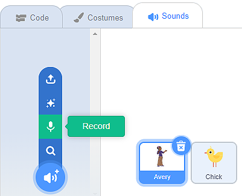
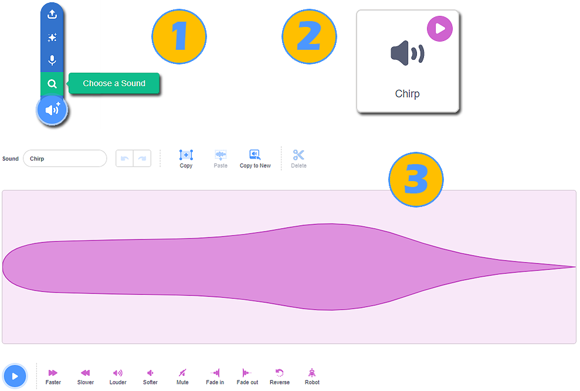
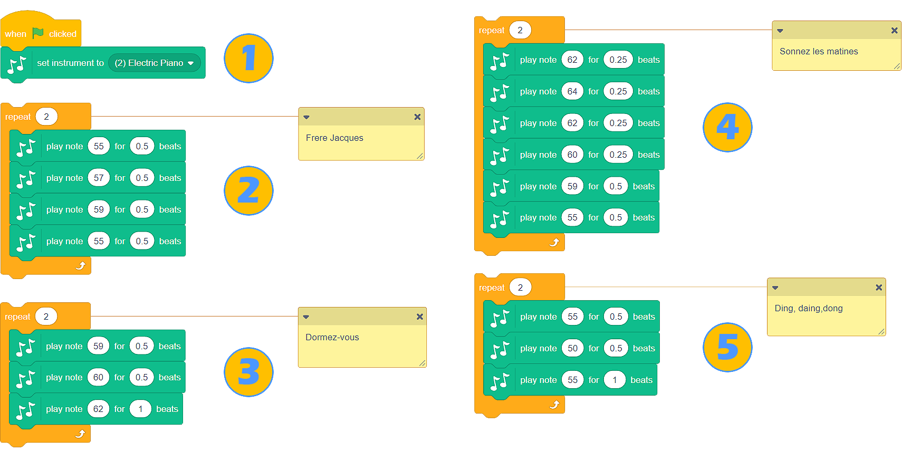

Tingull
=======

Aftësia për të shtuar tinguj në sprites, përveç flluskave me mendime dhe tekst në to, na jep mundësinë për të krijuar programe më dinamike dhe interesante.

Scratch ka një librari të pasur të tingujve, si dhe mundësinë për të regjistruar zërin tonë ose për të shkarkuar regjistrime të tingujve nga kompjuteri ynë në formatin Wav ose .mp3. Blloqet, të cilat na lejojnë të dëgjojmë tinguj, gjenden në kategorinë **Sound**.

Tinguj Sprite
------------------

Ne do të azhornojmë programin *Farm*, i cili mund të gjendet në lidhjen |https: //scratch.mit.edu/projects/326422653/|, në mënyrë që vajza (Avery) të thotë vërtet "Shko, shko!", dhe pulat cicërijnë pas një vakti të mirë.
   
.. |https://scratch.mit.edu/projects/326422653/| raw:: html

 <a href="https://scratch.mit.edu/projects/326422653/" target="_blank">https://scratch.mit.edu/projects/326422653/</a>

Hapi i parë do të ishte regjistrimi i tingullit - zëri ynë: ne do ta bëjmë regjistrimin dhe do ta shtojmë në skenarin që i përket vajzës; në regjistrim, duhet të themi: "Shko, shko!"

Regjistrimi i tingullit

Para se të regjistrojmë tingullin, duhet të:

• Sigurohuni që vajza e sprite është aktive (tabloja e spërkatjes duhet të ketë një kornizë blu rreth saj në listën e sprites);
• klikoni në butonin Sound;
• zgjidhni opsionin Record.

Do të hapet dritarja **Record Sound**; brenda kësaj dritare, ne mund të fillojmë regjistrimin e tingullit.

1. Klikoni butonin e kuq dhe thoni: "Shko, shko!";

2. Ju mund ta dëgjoni regjistrimin duke shtypur butonin **Play**, nëse jeni të kënaqur, duhet të klikoni në butonin **Save**, dhe nëse jo, klikoni në butonin **Re-register** dhe bëni përsëri;

3. Një paraqitje vizuale e regjistrimit do të shfaqet në kartën Sound;

4. Blloqet që lejojnë të dëgjohet zëri ynë gjatë ekzekutimit të programit, do të shfaqen në kategorinë Sound.

.. image:: ../_images/zvuk/GoGo.png  
   :align: center

Tingulli i pulës mund të gjendet në librarinë e tingullit dhe të ngarkohet prej tij.

Ne nuk duhet të harrojmë se cicerima e pulave duhet të jetë aktive; përndryshe, tingulli i bezdisshëm do t'i shtohet sprite vajzës.

Ne jemi të gatshëm për të shtuar blloqe komandash në kod.

.. image:: ../_images/zvuk/KodFarmaZvuk.png
   :width: 1200px
   :align: center

|Uradi| Përsërite projektin *Farm*, i cili mund të gjendet në linkun |https: //scratch.mit.edu/projects/326422653/|. Regjistroni tingullin dhe shtoni bllokun e duhur në skenarin që i përket vajzës. Nga libraria e tingullit, shtoni tingullin e duhur të cicërimës në skenarin që i përket sprukut
 
.. |https: //scratch.mit.edu/projects/326422653/| raw:: html

 <a href="https: //scratch.mit.edu/projects/326422653//" target="_blank">https: //scratch.mit.edu/projects/326422653/</a>

.. |Uradi| image:: ../_images/Uradi.png

.. mchoice:: ZvukZadatak1
   :answer_a: Nëse do të kishim zgjedhur bllokun tjetër, së pari do të kishim dëgjuar zërin tonë. Flluska e tekstit do të ishte shfaqur vetëm pasi të ishte shqiptuar fjalia.
   :answer_b: Mund të kishim përdorur bllokun e dytë, dhe programi do të kishte funksionuar në të njëjtën mënyrë.
   :feedback_a: Ju keni absolutisht të drejtë!
   :feedback_b: Kjo nuk është e saktë. Në programin *Farm*, zëvendësoni bllokun e paraqitur në figurën më lart, drejtoni progun
   :correct: a

Në programin Farm, ne zgjodhëm bllokun |GG| për të shtuar tingullin, dhe jo bllokun |GGUD|. Pse?

   .. |GGUD| image:: ../_images/zvuk/GGUD.png
   .. |GG| image:: ../_images/zvuk/GG.png

Kompozimi i muzikës
-------------------

.. |Ekstenzija| image:: ../_images/Ekstenzija.png

Mosveprimi i muzikës kërkon shtimin e një kategorie të re bllok në ndërfaqen Scratch. Kjo bëhet duke klikuar në butonin |Ekstenzija|, i cili ndodhet në këndin e poshtëm të majtë të ekranit, dhe më pas duke zgjedhur zgjatjen **Music**.

Pavarësisht se në cilën gjuhë flasin, njerëzit nga e gjithë bota e dinë gënjeshtrën e Frère Jacques. Nëse nuk e dini këngën, kërkoni atë në YouTube dhe ne do t'ju ndihmojmë ta kompozoni atë në Scratch.

Si instrumentin tonë, ne do të zgjedhim pianon elektrike (1), dhe pastaj do t'i lidhim shënimet në mënyrë që, kur të drejtojmë programin, kjo pjesë e famshme të fillojë të luajë.

|Uradi| Miksoni projektin *Frère Jacques*, i cili mund të gjendet në linkun | https: //scratch.mit.edu/projects/326431999/ | dhe shtoni blloqet që do të kontribuojnë në "plotësinë e zërit" (daulle ose seksioni i ritmit). Përdorni instrumentet nga lista drop-down e bllokut |Drums|. Duke përdorur bllokun e duhur nga kategoria **Sound** rrisni vëllimin e secilit varg me 10.

.. |https://scratch.mit.edu/projects/326431999/| raw:: html

 <a href="https://scratch.mit.edu/projects/326431999/" target="_blank">https://scratch.mit.edu/projects/326431999/</a>

|Izazov| Mundohuni të këndoni këngën Frère Jacques pa muzikë dhe ta regjistroni atë. Shtojeni atë në programin Scratch **Frère Jacques**. Ne e dimë me siguri që do të jetë një miksim interesant!
  
.. |Izazov| image:: ../_images/Izazov.png